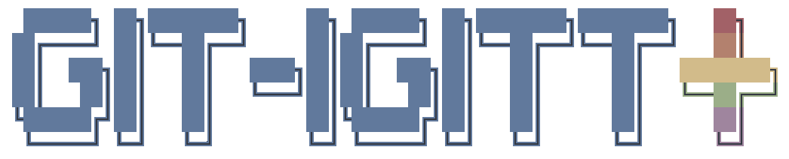
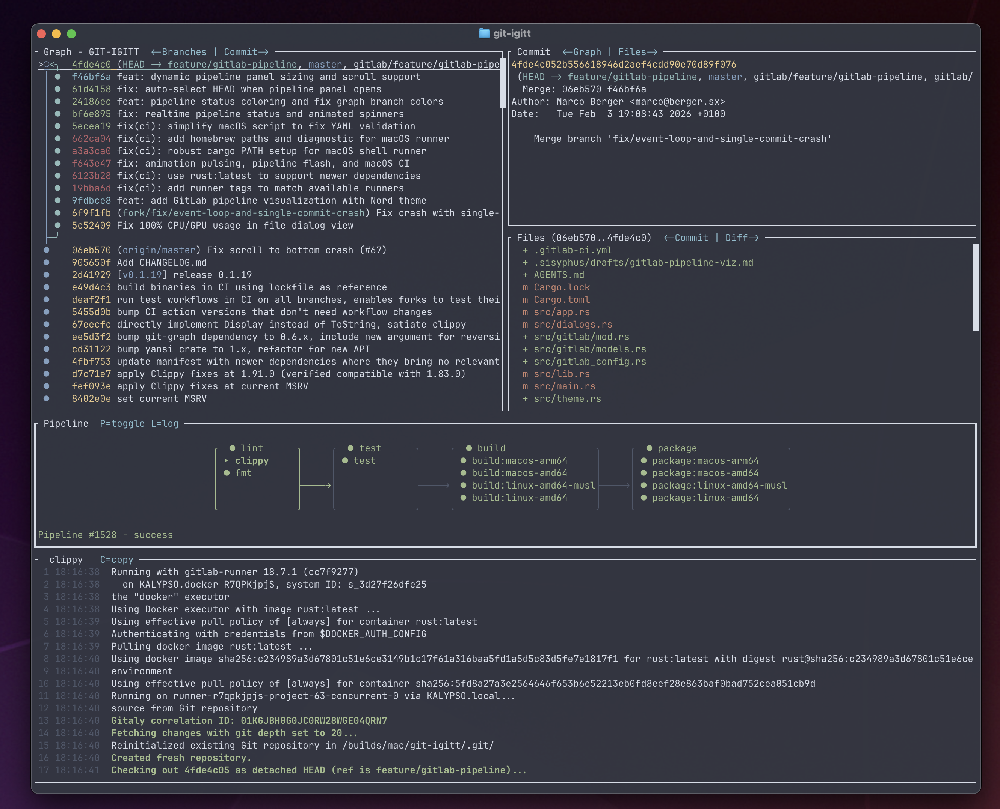

# git-igitt+



**git-igitt+** is a fork of [git-igitt](https://github.com/mlange-42/git-igitt) by Martin Lange, extended with CI/CD pipeline integration — starting with GitLab, with GitHub support planned.

Thank you to the original **git-igitt** project for building such a solid foundation for interactive Git history visualization in the terminal.

## What is git-igitt+?

An interactive terminal application for browsing and visualizing Git history graphs, with integrated CI/CD pipeline monitoring. Built on [git-graph](https://github.com/mlange-42/git-graph), it renders structured commit graphs following your branching model — and now shows your pipeline status right alongside your history.



## Features

* View structured Git history graphs directly in the terminal
* Interactively browse commits and diffs with syntax highlighting
* Pre-defined and custom branching models and coloring
* **GitLab CI/CD pipeline integration** — view pipeline stages, jobs, status, and logs
* Real-time pipeline status with animated spinners
* Dynamic pipeline panel sizing based on stage count
* Nord color theme throughout
* Startup logo overlay with Aurora gradient

### GitLab Integration

Press `P` to toggle the pipeline panel. It shows:

* Pipeline stages with job status (success, failed, running, pending)
* Job logs viewable inline — press `L` to toggle
* Auto-selects HEAD commit pipeline on open
* Real-time status updates with visual indicators

### Planned

* **GitHub Actions** integration (same pipeline panel, different backend)

## Installation

**Using `cargo`**

```
cargo install git-igitt
```

**From source**

```
git clone https://github.com/git-bahn/git-igitt.git
cd git-igitt
cargo install --path .
```

## Usage

```
git-igitt
```

If started inside a Git repository, that repository is displayed. Otherwise, a file dialog lets you select one.

### Key Bindings

| Key | Action |
|-----|--------|
| `H` / `F1` | Help |
| `Q` | Quit |
| `Left` / `Right` | Change panel |
| `Tab` | Panel fullscreen |
| `Esc` | Return to default view |
| `L` | Toggle layout |
| `B` | Toggle branch list |
| `P` | Toggle pipeline panel |
| `L` (in pipeline) | Toggle job log |
| `M` | Set branching model |
| `Shift+L` | Toggle logo |
| `Up` / `Down` | Navigate |
| `Enter` | Jump to branch/tag |
| `F3` / `Ctrl+F` | Search |
| `D` / `N` / `O` | Diff / new / old file version |
| `S` | Toggle syntax highlighting |

### Branching Models

By default, git-igitt uses the `git-graph` branching model. Press `M` to change it, or start with:

```
git-igitt --model simple
```

For details on branching models, styles, and formatting, see the [git-graph manual](https://github.com/mlange-42/git-graph/blob/master/docs/manual.md).

### Custom Branching Models

Branching models are configured in `APP_DATA/git-graph/models`:

* **Windows:** `C:\Users\<user>\AppData\Roaming\git-graph`
* **Linux:** `~/.config/git-graph`
* **macOS:** `~/Library/Application Support/git-graph`

See [Custom branching models](https://github.com/mlange-42/git-graph/blob/master/docs/manual.md#custom-branching-models) in the git-graph manual.

## GitLab Configuration

To use the pipeline integration, configure your GitLab connection in the application or create a `.git-igitt.toml` in your repository root:

```toml
[gitlab]
url = "https://gitlab.example.com"
project_id = 123
token = "your-access-token"
```

Or press `G` in the application to open the GitLab configuration dialog.

## Limitations

* Merge commit summaries should not be modified (git-graph needs them)
* Supports only the primary remote repository `origin`
* No "octopus merges" (max 2 parents)
* No shallow clone support (libgit2 limitation)
* Syntax highlighting may be slow for large files (toggle with `S`)

## Acknowledgments

This project is a fork of [git-igitt](https://github.com/mlange-42/git-igitt) by [Martin Lange](https://github.com/mlange-42). The original project provides the core Git graph visualization built on [git-graph](https://github.com/mlange-42/git-graph).

## License

[MIT](LICENSE)
